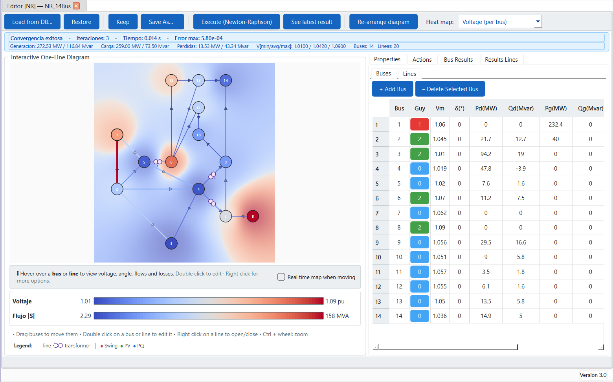
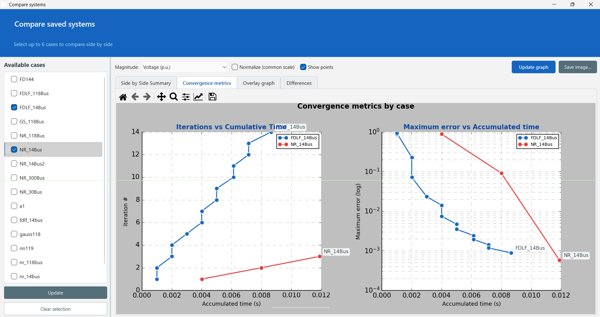
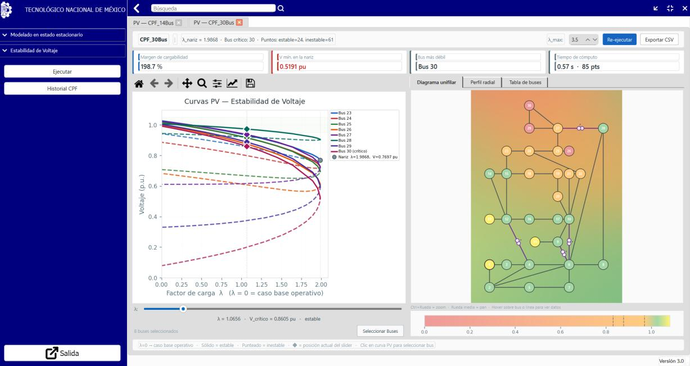
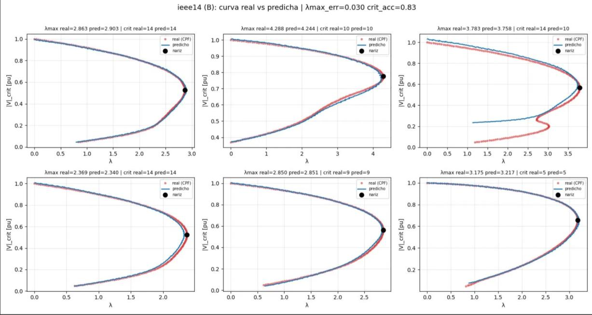
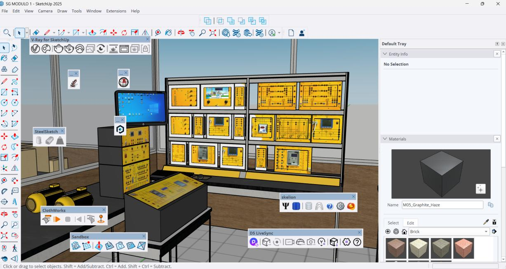
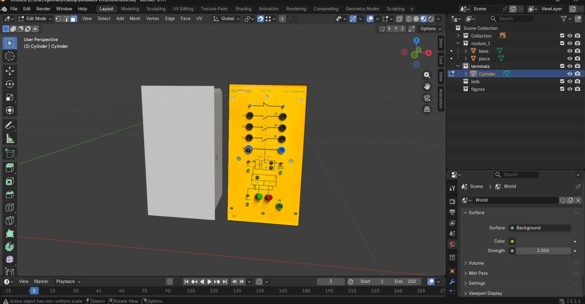
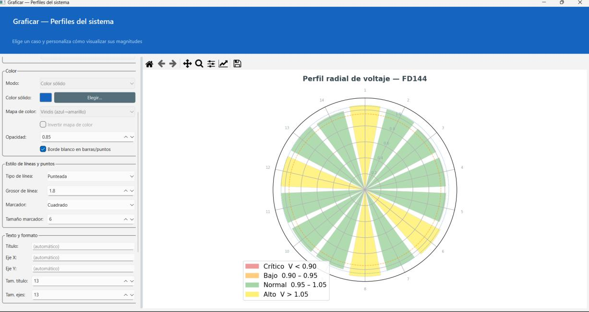

# Elí Johnatan Muñoz Luna
### Power Systems Engineer · Software & ML Developer · Simulation / VR

I design and build software platforms that simulate, analyze, and visualize electrical power
systems — combining Python engineering, numerical methods, machine learning, and real-time
3D/VR environments to make complex grid behavior tangible and interactive.

---

## Contents

- [Stage 01 — Foundations](#stage-01--foundations)
- [Stage 02 — M.Sc. Electrical Engineering](#stage-02--msc-electrical-engineering)
- [Stage 03 — D.Sc. Electrical Engineering (in progress)](#stage-03--dsc-electrical-engineering-power-systems-in-progress)
- [Technical Skills](#technical-skills)
- [Contact](#contact)

---

## Stage 01 — Foundations

**B.Eng. in Renewable Energy Engineering** · TecNM Campus La Laguna · 2016–2021
Specialization: Solar Energy

Built the core engineering foundation — circuit theory, electrical systems, and renewable
generation technologies — that later translated directly into the software and simulation
work developed at the graduate level.

---

## Stage 02 — M.Sc. Electrical Engineering

**TecNM Instituto Tecnológico de La Laguna** · 2022–2023
Specialization: Power Electronics · Advisor: Dra. Concepción Hernández Flores

### Thesis — Modular Power Systems Simulator (Python)

Designed and engineered a full simulation platform in Python from the ground up: a modular,
object-oriented architecture built on class inheritance, allowing new computational modules to
be added without touching the existing codebase. Delivered two functional modules on this
shared core — an RLC circuit simulation engine and a power-flow solver (Fast Decoupled method)
— each an independent, swappable component.

The desktop GUI was built with PyQt6/PySide6 (custom frameless windows, multi-tab workspace,
responsive layouts), designed to be usable without programming knowledge. NumPy and SciPy
handled matrix algebra and iterative solving; Pandas managed structured data pipelines.
PostgreSQL served as the relational persistence layer for simulation results, with Git for
version control throughout.

`Python` `OOP / Class Inheritance` `PyQt6 / PySide6` `NumPy` `SciPy` `Pandas` `PostgreSQL` `Git`

<table>
<tr>
<td width="50%">

<b>Fig. 1</b> — Interactive one-line diagram with live voltage heat map, IEEE 14-bus system.
</td>
<td width="50%">

<b>Fig. 2</b> — Benchmarking module comparing Newton-Raphson vs. Fast Decoupled convergence.
</td>
</tr>
</table>

> **📄 Peer-reviewed publication**
> **"Determination of Power Flows in an Electrical Network Using the Fast Decoupled Method in Python"**
> Muñoz-Luna, E.J.; Luna-Aguilera, C.; Hernández-Flores, C.; Arjona-López, M.A. — *Ciencia, Ingeniería
> y Desarrollo TEC Lerdo*, 2024, Vol. 1, No. 10, ISSN 2448-623X.
> Documented a six-module Python codebase and validated results against OpenDSS (industry-standard
> reference software) on IEEE 14- and 30-bus systems.

---

## Stage 03 — D.Sc. Electrical Engineering, Power Systems `[in progress]`

**TecNM Instituto Tecnológico de La Laguna** · 2023–Present
Advisor: Dra. Concepción Hernández Flores · Co-Advisor: Dr. Marco Antonio Arjona López

### Project — Power Grid Simulator with Virtual Reality & Machine Learning

A large-scale evolution of the master's platform into a system spanning backend software
engineering, applied machine learning, and real-time 3D/VR development, with Python and
PostgreSQL as the common backbone throughout.

### Voltage Stability Engine

Implemented the Continuation Power Flow (CPF) method as a full interactive module — migrated
from a command-line prototype into a GUI application with real-time P-V curve tracing, automatic
loadability-margin calculation, and voltage-collapse point detection.

<b>Fig. 3</b> — Interactive voltage stability module: P-V curves, loadability margin, and critical-bus detection (IEEE 30-bus system).

### Machine Learning — Graph Neural Networks

Built an end-to-end ML pipeline: an automated synthetic dataset generator producing topological
tensors and load-profile scenarios from thousands of CPF runs, feeding Graph Neural Networks
(GNNs) trained in PyTorch. Models predict the maximum loading factor and nodal voltage profile
along the P-V curve, and classify grid state — stable, near-collapse, unstable — in real time.
Validated across five IEEE benchmark systems (14, 30, 57, 118, 300 buses), with loading-factor
error as low as ~0.023 and classification accuracy up to 1.00.

<b>Fig. 4</b> — GNN-predicted vs. simulated P-V curves across IEEE 14-bus test scenarios.

`PyTorch` `Graph Neural Networks` `Continuation Power Flow` `Synthetic Data Pipelines` `PostgreSQL`

### Virtual Reality & 3D Simulation Pipeline

*Digital twin of the "De Lorenzo" Smart Grid laboratory.*

A three-stage 3D pipeline builds the immersive side of the simulator: SketchUp for rapid spatial
layout of the physical lab hardware, Blender for high-fidelity modeling, retopology, and PBR
texturing optimized for real-time rendering, and Unity with C# for the interactive VR
environment and object-behavior scripting — grounded in Digital Twin theory, progressing toward
a fully bidirectional twin of the physical laboratory.

<b>Fig. 5</b> — Full Smart Grid lab layout modeled in SketchUp, used for spatial planning ahead of detailed 3D work.

<table>
<tr>
<td width="50%">

<b>Fig. 6</b> — High-fidelity module modeling in Blender, prepared for retopology and real-time rendering.
</td>
<td width="50%">

<b>Fig. 7</b> — Radial voltage-profile visualization in the simulator's plotting module.
</td>
</tr>
</table>

`SketchUp` `Blender` `Unity / C#` `Retopology & PBR Texturing` `Digital Twin Architecture`

### Manuscript in progress

**"Development of an Educational Simulation Environment for Power Flow Analysis in Python"**
An open-source educational tool comparing Newton-Raphson, Gauss-Seidel, and Fast Decoupled
solvers, with a PyQt6 interface, NetworkX-based one-line diagram rendering, and
PostgreSQL-backed result tracking.

---

## Technical Skills

| Category | Stack |
|---|---|
| **Languages & APIs** | Python (advanced) · C# · SQL · REST API integration |
| **Machine Learning** | PyTorch · Graph Neural Networks · NumPy · SciPy · Pandas |
| **Databases** | PostgreSQL — schema design, relational persistence, structured storage for simulation & ML datasets |
| **Software Engineering** | OOP & modular architecture · PyQt6/PySide6 desktop GUIs · Git |
| **Simulation / 3D / VR** | Unity (C#) · Blender · SketchUp · NetworkX |
| **Domain** | Power flow analysis · voltage stability · numerical methods |

---

## Contact

📧 [johnamn97@gmail.com](mailto:johnamn97@gmail.com) · 💼 [linkedin.com/in/ejohnatanml](https://www.linkedin.com/in/ejohnatanml) · 🖥️ [github.com/Johnamon97](https://github.com/Johnamon97)
